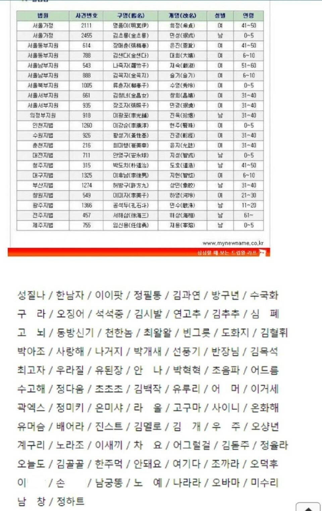
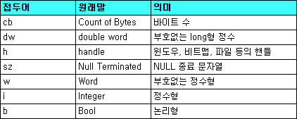

# chapter 2 의미있는 이름

> 

나는 네이밍에 나름 큰 시간을 투자하는 편이다.  
영어공부를 한다는 변명으로 사전을 찾아보거나 번역기를 돌리거나 등등  
개발자라면 그 누구라도 의미있는 이름을 짓기위해 이런 수고를 들일것이라 믿고 있다.

* 의도를 분명히 밝혀라
  
  여기에 조건에 맞는 무언가를 가져오는 함수가 있다.
  ``` javascript
  function getSomething(data) {
    const result = [];
    for (const d of data) {
      if (d === 5) {
        result.push(d);
      }
    }
    return result;
  }
  ```
  코드의 길이도 짧고 단순하기 때문에 읽기엔 편하지만 이 함수가 하는 일은 개발자가 알고 있다는 전제가 깔려있다.  
  함수가 하는 일이 명시적으로 드러나 있지 않다.
  
  아래의 함수는 위의 함수에서 이름만 바꿔주었다.
  ``` javascript
  function getAdminAccounts(accounts) {
    const result = [];
    for (const account of accounts) {
      if (account.isAdmin()) {
        result.push(account);
      }
    }
    return result;
  }
  ```
  
  위의 `getAccounts()`는 프로젝트를 이해하고 있는 개발자가 아니더라도 위 함수의 역할이 무엇인지 명확하게 알 수 있다.
  
  명확한 의도를 전달 할 수 있는 이름을 가진 함수는 그 자체만으로도 큰 장점을 가질 수 있다.

* 잘못된 정보를 피해라

  아래의 코드는 실제로 겪었던 코드의 예시이다.
  
  ``` javascript
  function getSomethingDatas(condition?) {
    const data = DB.getdata();
    let result = data;
    
    if (condition) {
      result = data.filter(v => v === condition)[0];
    }
    
    return result;
  }
  ```
  
  위의 함수는 조건에 따라 객체 또는 배열이 나올 수 있다.  
  함수명만 봤을 때에는 조건에 맞는 데이터들을 가져온다고 생각했다.  
  하지만 실제로 동작하는 코드는 조건에 맞는 데이터가 있으면 조건에 맞는 첫번째 데이터만 반환해준다.  
  심지어 배열도 아니다!
    
  위의 경우 처럼 단순한 함수 이름 하나만으로 완전히 다른 정보가 나오는 경우도 있다.  
  이런 잘못된 정보를 주는 경우는 피하도록 하자.

* 의미 있게 구분해라
  > 이부분은 위의 내용들과 많이 겹친다 생각함.

  ``` java
  public static void copyChars(char a1[], char a2[]) {
    for (int i = 0 ; i < a1.length; i++) {
      a2[i] = a1[i]
    }
  }
  ```
  이 함수의 매개변수 명이 단순히 a1, a2로 되어있다.  
  함수의 동작에 따라 `public static void copyChars(char src[], char dest[])`로 매개변수 명이 바뀐다면  
  훨씬 더 보기 좋은 함수가 될 수 있을것이다

* 발음하기 쉬운 이름을 사용해라

  내가 여지껏 경험해온 대부분의 개발자들은  
  1차적으로 본인이 아는 단어  
  2차적으로 구글번역기 를 뒤지기 때문에 책에서 말하는 것만큼 특이한 케이스가 나오지 않았다.
  

* 검색하기 쉬운 이름을 사용해라 

  오히려 이 경우가 발음하기 쉬운 이름과는 대척점에 있는 경우였다.  
  본인이 아는 단어 이외의 경우 구글번역기 등에서 가져오니 뜻은 맞지만 본인이 기억하지 못하는 경우가 있다.  
  때문에 본인이 작성했다 하더라도 몇몇 기억 못하는 변수명, 함수명 등을 사용해 검색을 어려워 했던 적이 더러 있다.  
  
  개발자에게 영어공부가 이렇게도 중요하다..

* 인코딩을 피해라
  * 헝가리안 표기법  
  
  학교다니면서 배우던 WinAPI 수업때 항상 쓰던 방식이었다.  
  모든 변수가 정수 핸들, long 포인터, void 포인터, 여러 문자열 들로 이루어져 있어  
  해당 변수에 대한 설명을 접두어로 표현한 것이 헝가리안 표기법이다. 
  
  
  
  이때 이외로 해당 표기법을 본적이 없다.
  
  * 멤버변수 접두어
  
  이전에 Java에서 작업할때 간혹 본 적이 있다.  
  `m_` 라는 접두어가 멤버변수 앞에 붙어있는 형태였는데 어짜피 IDE에서 사전 필터링이 되던 터라 꼭 필요한 형태의 접두어는 아니었다.  
  
  오히려 JavaScript를 사용하는 초창기에 private 변수를 가리키기 위해 `_` 또는 `__`를 접두어로 사용하곤 했었는데  
  다양한 패턴과 prototype을 사용해 이를 처리하기도 했고  
  발전하는 언어와 IDE로 요즘은 꽤 줄어든 편으로 보인다.
  
  * 인터페이스 클래스와 구현 클래스  
 
  인터페이스 클래스와 구현 클래스에 접두어(`I`) / 접미어(`Imp` or `Impl`)를 쓰는 경우는 최근까지도 보았고 나도 곧잘 사용했다.  
  책에서 처럼 굳이 인터페이스와 구현 클래스 둘 다에 접두어 / 접미어를 사용해줄 필요없이 구현 클래스에만 적어주는 것이 더 깔끔하지 싶다.  
  이건 실제로 작업해보면서 본인한테 맞는것을 익혀봐야 겠다.(어짜피 대부분 회사는 코딩 컨벤션 있겠지)
  

* 자신의 기억력을 자랑하지 마라

  자신의 지적 허영심을 위해 어려운 코드를 작성하지 말아야 한다.
  
  
  빈수레가 요란하다고 나중가면 다 들킨다.
  
  나도 첫회사 입사할 때 나왔던 swap 코드 작성에 아래와 같은 코드를 짠 적이 있다.  
  ``` c++
  void swap(int *a, int *b) {
    *a ^= *b ^= *a ^= *b;
  }

  int main() {
    int a = 5, b = 10;
    swap(&a, &b);
    printf("%d, %d", a, b);
  }
  ```
  
  지금 보면 참 부끄러운 코드다.

* 클래스 이름

  명사 또는 명사구를 사용해라.  
  동사는 사용하지 않는다.

* 메소드 이름

  동사 또는 동사구를 사용해라.  
  책에서는 자바를 기준으로 나와있지만 어떤 언어든 스펙 또는 코딩 컨벤션에 맞게 작성하면 된다

* 기발한 이름은 피해라

  pneumonoultramicroscopicsilicovolcanoconiosis. 진폐증.  
  이런거 쓰지마라

* 한 개념에 한 단어를 사용해라

  번역기를 돌려서 나오는 단어를 사용하다 보면 해당 규칙을 어기는 경우가 곧잘 생긴다.  
  그 외의 경우는 보통 익숙하고 아는 단어 위주로 사용하다 보니 여지껏 해당 규칙으로 이슈가 발생해 본적은 없다.  
  아무튼 주의하도록 하자

* 말장난을 하지 마라

  [유지보수하기 어렵게 코딩하는 방법](https://www.hanbit.co.kr/store/books/look.php?p_code=E2375873090) 에서 나왔던 내용인 것 같은데  
  동음이의어, 다의어 등을 사용한 코드는 읽는 개발자에게 혼란을 줄 수 있으니 지양해야 한다.

* 해법 영역에서 가져온 이름을 사용해라

  코드를 읽는 사람 역시 프로그래머이다. 전산용어, 알고리즘 이름, 패턴 이름, 수학 용어들은 사용해도 무방하다.  
  기술 개념에는 기술 이름이 가장 적합한 선택이다.

* 문제 영역에서 가져온 이름을 사용해라

  적절한 '프로그래머 용어'가 없다면 문제 영역에서 이름을 가져온다.  
  문제 영역과 관련이 깊은 코드라면 문제 영역에서 이름을 가져오는 것이 좋다.  
  그렇다면 그 분야 전문가에게 의미를 물어 파악할 수 있다.

* 의미있는 맥락을 추가해라

  책에 나오는 예시를 들어, `firstName`, `lastName`, `street`, `houseNumber`, `city`, `state`, `zipcode` 라는 변수가 있다면 
  이 변수들을 훑어 보면 주소라는 사실을 알 수 있다.
  
  하지만 `state` 변수 하나만 사용한다면? 변수 `state`가 주소의 일부라는 사실을 쉽게 알아채긴 어려울 것이다.  

* 불필요한 맥락을 없애라

  불필요한 접두, 접미, 중복 등은 피해라.
